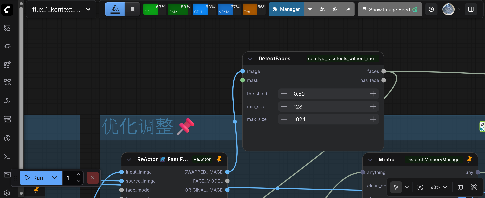
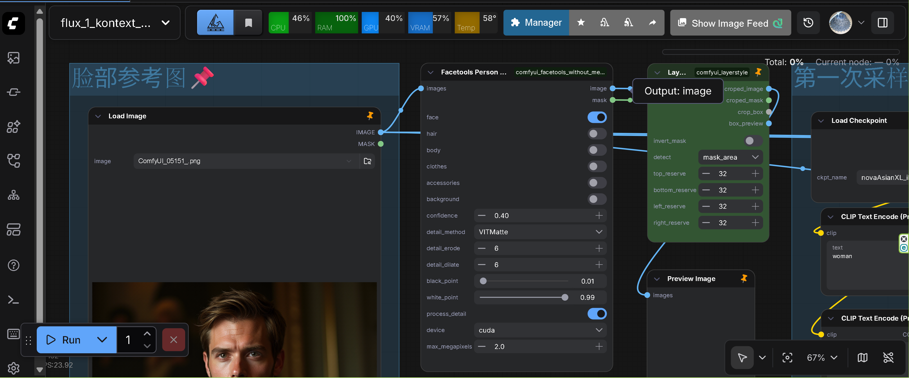

# comfyui_facetools_disabled_mediapipe

Face detection & restoration tools for ComfyUI by Sunx.ai

## Project Purpose

This extension was created to address the compatibility issue with MediaPipe in Python 3.13 and later versions. While there are many facetools extensions for ComfyUI that use MediaPipe, MediaPipe is no longer compatible with Python 3.13+. This project replaces MediaPipe with InsightFace and provides a unified management solution for face detection and processing tools.

**Key Objectives:**
- Replace MediaPipe-based implementations with InsightFace for Python 3.13+ compatibility
- Consolidate and manage face detection/processing nodes in a single extension
- Maintain functionality while ensuring compatibility with modern Python versions

> [!WARNING]
> **Important Limitation**: InsightFace does not provide the same level of detailed detection as MediaPipe. Some features may be limited compared to the original MediaPipe-based implementations. The original functionality may be restricted or simplified in some cases.

## Quickstart

**⚠️ Note**: This extension is not available in ComfyUI Manager. You must install it manually.

1. Install [ComfyUI](https://docs.comfy.org/get_started).
2. Clone this repository into your `ComfyUI/custom_nodes` directory:
   ```bash
   cd ComfyUI/custom_nodes
   git clone https://github.com/ussoewwin/comfyui_facetools_disabled_mediapipe.git
   ```
3. Install dependencies from `requirements.txt`:
   ```bash
   cd comfyui_facetools_disabled_mediapipe
   pip install -r requirements.txt
   ```
   **Important**: For Python 3.13 Windows users, see the [Installation Dependencies](#installation-dependencies) section below for special instructions.
4. Restart ComfyUI.

# Features

## Face Detection & Processing
- **DetectFaces**: Detects faces in images using InsightFace and returns the face with the largest area. Supports configurable detection threshold (0.0-1.0), minimum and maximum face size filtering, and optional mask input to exclude certain regions from detection.

  
- **DetectFaceByIndex**: Detects faces by index with advanced filtering options. Supports left-to-right selection of specific faces (0=leftmost, 1=second, etc.), gender filtering (0=any gender, 1=male, 2=female), and priority mode selection (0=index priority, 1=gender priority). Gender detection uses InsightFace and is only enabled when needed for improved performance. Includes configurable threshold, min/max size, and optional mask input.
- **CropFaces**: Crops detected face regions from images. Supports configurable crop size (512-1024), crop factor (1.0-3.0) for expanding the crop area, and multiple mask types. Returns cropped images, masks, and warp matrices for later reconstruction.
- **WarpFacesBack**: Warps processed faces back to their original positions in the source image. Uses the warp matrices generated by CropFaces to accurately place modified faces back into the original image coordinates.
- **SelectFloatByBool**: Utility node that selects a float value based on a boolean condition. Returns `true_value` when condition is True, `false_value` when False. Useful for conditional workflows.
- **InstantIDModelLoader**: Loads InstantID model files (.safetensors or .ckpt) for face identity preservation. Prepares the model with proper cross-attention dimensions and CLIP embeddings for face swap functionality.
- **InstantIDFaceAnalysis**: Initializes InsightFace face analysis model for InstantID. Supports multiple execution providers (CPU, CUDA, ROCM, CoreML). Uses antelopev2 model for face detection and feature extraction.
- **ApplyInstantID**: Main node for applying InstantID face identity preservation. Takes a reference face image, extracts face embeddings and keypoints, and applies them to the diffusion model via ControlNet. Supports configurable weight (0.0-5.0), start/end timesteps for control application, and optional pre-computed face embeddings for performance optimization.
- **SaveFaceEmbeds**: Saves face embeddings to disk as .pt files. Stores both conditional and unconditional embeddings along with metadata. Automatically handles memory management and prevents overwriting existing files.
- **LoadFaceEmbeds**: Loads previously saved face embeddings from disk. Supports loading both normal face embeddings and no-face markers. Useful for reusing face identity information across multiple workflows.
- **VAEDecodeNew**: VAE decoder that converts latent representations back to pixel space images. Includes optimization: when `has_face` is False, returns a blank 512x512 canvas to save VAE decode time in workflows where no face is detected.
- **VAEEncodeNew**: VAE encoder that converts images to latent representations. Includes optimization: when `has_face` is False, returns a blank latent (64x64) to save VAE encode time in workflows where no face is detected.
- **ColorAdjustNew(FaceParsing)**: Advanced face color adjustment with face parsing support. Adjusts contrast, brightness, saturation, hue, and gamma values. Only processes images when `has_face` is True, otherwise returns the original image unchanged for performance optimization.
- **SaveImageWebsocketNew**: Saves images via WebSocket in JPEG format. Supports configurable JPEG quality (60-100). Performs JPEG compression in memory before sending, useful for reducing bandwidth in WebSocket-based workflows.
- **facetools_humanSegmentation**: Human segmentation using InsightFace face detection. Adapted from `comfyui-easy-use`'s `humanSegmentation` node. Detects faces using InsightFace and generates segmentation masks by expanding bounding boxes by 10% for better coverage. Supports configurable confidence threshold (0.05-0.95) to filter detection results. Returns RGBA image with alpha channel mask and separate mask tensor output. Note: Uses bounding box-based segmentation rather than pixel-perfect segmentation due to InsightFace limitations. Original Repository: [comfyui-easy-use](https://github.com/yolain/comfyui-easy-use) (Please check the original repository for license information)
- **facetools_PersonMaskUltraV2**: Advanced person mask generation with detailed component selection. Adapted from `ComfyUI_LayerStyle_Advance`'s `PersonMaskUltraV2` node. Supports selective masking of face, hair, body, clothes, accessories, and background components. Uses InsightFace for face detection and expands bounding boxes (10% for face, 30% for body/clothes) to create masks. Supports multiple detail processing methods (VITMatte, VITMatte(local), PyMatting, GuidedFilter) with configurable erode (1-255) and dilate (1-255) operations for mask refinement. Includes black point (0.01-0.98) and white point (0.02-0.99) adjustment for mask contrast control, device selection (CUDA/CPU), and max megapixels (1.0-999.0) for performance optimization. Returns RGBA image with mask and separate mask output. Original Repository: [ComfyUI_LayerStyle_Advance](https://github.com/chflame163/ComfyUI_LayerStyle_Advance) (Please check the original repository for license information)

  
- **facetools_FacialSegment**: Facial feature segmentation for individual components. Adapted from `ComfyUI_LayerStyle_Advance`'s `MediapipeFacialSegment` node. Uses InsightFace keypoints (right_eye, left_eye, nose, mouth_left, mouth_right) to segment facial features. Supports selective segmentation of left/right eyes, left/right eyebrows, lips, and teeth. Processes images at 4x scale for better detection accuracy, then scales masks back to original size. Applies Gaussian blur (radius 2) to mask edges for smooth transitions. Returns RGBA image with feature mask and separate mask output. Note: Feature detection is based on keypoint positions and estimated sizes, which may be less precise than MediaPipe's pixel-level segmentation. Original Repository: [ComfyUI_LayerStyle_Advance](https://github.com/chflame163/ComfyUI_LayerStyle_Advance) (Please check the original repository for license information)

> [!NOTE]
> The segmentation nodes (facetools_humanSegmentation, facetools_PersonMaskUltraV2, facetools_FacialSegment) were adapted from original implementations in `comfyui-easy-use` and `ComfyUI_LayerStyle_Advance`, with MediaPipe replaced by InsightFace for Python 3.13 compatibility.

> [!WARNING]
> **Detection Accuracy Limitation**: InsightFace cannot achieve the same level of detailed detection as MediaPipe. Some segmentation features may be less precise or have reduced functionality compared to the original MediaPipe-based implementations. The original functionality may be restricted in some cases.

## Installation Dependencies

This extension uses InsightFace for high-precision gender detection (replacing mediapipe for Python 3.13 compatibility). Models will be automatically downloaded on first use:

### Standard Installation (Python 3.10-3.12)

```bash
pip install insightface
```

### Python 3.13 Users (Windows Only)

**⚠️ Important**: The standard `pip install insightface` does not provide Python 3.13 wheels. Windows users running Python 3.13 must download the pre-built wheel from:

**https://huggingface.co/ussoewwin/Insightface_for_windows/tree/main**

Download the appropriate wheel file (`insightface-0.7.3-cp313-cp313-win_amd64.whl`) and install it directly:

```bash
pip install insightface-0.7.3-cp313-cp313-win_amd64.whl
```

**Note**: This is Windows-only. Linux/macOS Python 3.13 users will need to build from source or use Python 3.12 or earlier.

**Note**: InsightFace requires additional model files that will be automatically downloaded on first run.

### Gender Detection Features
- Uses InsightFace for high-precision gender recognition
- Supports both GPU and CPU modes with automatic device selection
- Provides age detection and confidence information
- Supports fallback mechanism (based on facial aspect ratio)
- Prevents division by zero errors to ensure stable operation

## Develop

To install the dev dependencies and pre-commit (will run the ruff hook), do:

```bash
cd comfyui_facetools_disabled_mediapipe
pip install -e .[dev]
pre-commit install
```

The `-e` flag above will result in a "live" install, in the sense that any changes you make to your node extension will automatically be picked up the next time you run ComfyUI.

## Publish to Github

Install Github Desktop or follow these [instructions](https://docs.github.com/en/authentication/connecting-to-github-with-ssh/generating-a-new-ssh-key-and-adding-it-to-the-ssh-agent) for ssh.

1. Create a Github repository that matches the directory name.
2. Push the files to Git
```
git add .
git commit -m "project scaffolding"
git push
```

## Writing custom nodes

An example custom node is located in [node.py](src/comfyui_facetools_disabled_mediapipe/nodes.py). To learn more, read the [docs](https://docs.comfy.org/essentials/custom_node_overview).


## Tests

This repo contains unit tests written in Pytest in the `tests/` directory. It is recommended to unit test your custom node.

- [build-pipeline.yml](.github/workflows/build-pipeline.yml) will run pytest and linter on any open PRs
- [validate.yml](.github/workflows/validate.yml) will run [node-diff](https://github.com/Comfy-Org/node-diff) to check for breaking changes

## License

This project is licensed under the **GNU General Public License v3.0 (GPL-3.0)**. See [LICENSE](LICENSE) file for details.

### Third-Party Components

The following components are adapted from other repositories and may have different licenses:

- **Facetools Human Segmentation (InsightFace)**: Adapted from [comfyui-easy-use](https://github.com/yolain/comfyui-easy-use). Please refer to the original repository for its license information.
- **Facetools Person Mask Ultra V2 (InsightFace)**: Adapted from [ComfyUI_LayerStyle_Advance](https://github.com/chflame163/ComfyUI_LayerStyle_Advance). Please refer to the original repository for its license information.
- **Facetools Facial Segment (InsightFace)**: Adapted from [ComfyUI_LayerStyle_Advance](https://github.com/chflame163/ComfyUI_LayerStyle_Advance). Please refer to the original repository for its license information.

**Important**: When using these adapted components, you must comply with both this project's GPL-3.0 license and the licenses of the original repositories from which these components were adapted.

